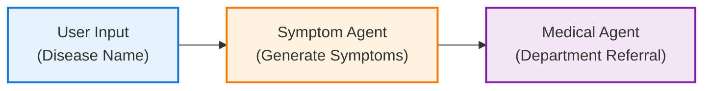

# Agentic Flows with Deterministic Execution

This document outlines the implementation of deterministic flows in agentic
systems, ensuring reproducibility and reliability in task execution using the
OpenAI Agent SDK with Azure AI Foundry integration.

## Overview

Deterministic flows are designed to produce consistent, predictable output given
the same input, regardless of external factors. This approach is crucial in
scenarios where consistency and predictability are required.

## Key Concepts

### Agents

Individual AI components that perform specific tasks with defined instructions
and output formats.

### Runner

The orchestration class that manages the execution flow between agents, ensuring
deterministic behavior.

### Structured Output

Using Pydantic models to enforce consistent output formats and enable type
safety.

## Architecture

The following diagram illustrates the deterministic flow architecture:



### Flow Description

1. **User Input**: A disease name is provided as input
2. **Symptom Agent**: Processes the disease name and generates a succinct
   symptom description
3. **Medical Agent**: Analyzes the symptom and determines the appropriate
   hospital department and reasoning

## Implementation Example

### Agent Configuration

The system uses two specialized agents with distinct responsibilities:

#### Symptom Agent

```python
symptom_agent = Agent(
    name="symptom_agent",
    instructions=(
        "You are a medical symptom generator. Given a disease or medical condition, "
        "generate the most characteristic and clinically significant symptoms that "
        "patients typically experience. Focus on primary symptoms that are commonly "
        "observed and would be most relevant for medical triage. Present symptoms "
        "in a clear, concise manner using medical terminology that healthcare "
        "professionals would recognize. Prioritize symptoms by frequency and "
        "diagnostic significance."
    ),
    model=OpenAIChatCompletionsModel(...)
)
```

#### Medical Agent

```python
medical_agent = Agent(
    name="medical_agent",
    instructions=(
        "You are a medical triage specialist. Analyze the given symptoms and provide "
        "a comprehensive assessment including: 1) Clear reasoning that explains the "
        "medical rationale for your recommendation, 2) The most appropriate hospital "
        "department name for initial evaluation and treatment. Consider symptom "
        "severity, urgency, and specialization requirements. Provide professional, "
        "evidence-based recommendations suitable for healthcare routing decisions."
    ),
    model=OpenAIChatCompletionsModel(...),
    output_type=DepartmentOutput
)
```

### Structured Output Model

```python
class DepartmentOutput(BaseModel):
    reasoning: str
    department_name: str
```

## Code Structure

The deterministic flow implementation consists of:

- **Agent Definitions**: Configured with specific instructions and models
- **Output Models**: Pydantic schemas for structured responses
- **Execution Flow**: Sequential processing using the Runner class
- **Azure Integration**: Leveraging Azure OpenAI services through dependency
  injection

## Usage

### Running the Example

```bash
# Activate virtual environment
source .venv/bin/activate

# Run the deterministic flow example
python -m openai_agent.agentic_patterns.deterministic_flow
```

### Sample Interaction

```
Input prompt: Enter a medical condition or disease name (e.g., 'diabetes', 'pneumonia', 'migraine'):
User input: diabetes

Output:
Symptom:
Frequent urination, excessive thirst, and unexplained weight loss

Department Information:
   Reasoning: These symptoms are characteristic of diabetes mellitus,
              requiring endocrine evaluation and management
   Department Name: Endocrinology
```

## Best Practices

### 1. Use Structured Output Types

Define clear Pydantic models to ensure consistent output formats:

```python
class MyOutput(BaseModel):
    field1: str
    field2: int
```

### 2. Clear Agent Instructions

Provide specific, unambiguous instructions to agents

### 3. Sequential Processing

Use the Runner class to ensure proper sequencing:

```python
result1 = await Runner.run(agent1, input_data)
result2 = await Runner.run(agent2, result1.final_output)
```

### Environment Setup

Ensure your `.env` file contains the required Azure OpenAI configuration:

```env
AZURE_OPENAI_ENDPOINT=your_endpoint
AZURE_OPENAI_API_KEY=your_api_key
AZURE_OPENAI_DEPLOYMENT_NAME=your_model_deployment
```
