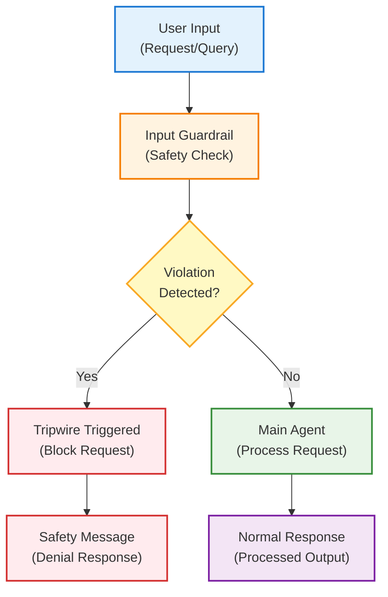

# Agentic Flows with Input Guardrails

This document outlines the implementation of input guardrail patterns in agentic
systems, demonstrating how to protect agents from inappropriate or harmful
requests using the OpenAI Agent SDK with Azure AI Foundry integration.

## Overview

Input guardrail patterns enable proactive filtering and validation of user
inputs before they reach the main agent processing logic. This approach is
crucial for building safe, compliant systems that can identify and block
potentially harmful, inappropriate, or policy-violating requests.

In **content moderation** contexts, guardrails prevent agents from processing
requests that violate platform policies or legal regulations. For **safety
enforcement**, this pattern blocks requests that could lead to harmful outcomes
or inappropriate responses. **Compliance assurance** is maintained by filtering
requests that might violate industry regulations or organizational policies.
Additionally, guardrails facilitate **risk mitigation** by providing an
additional layer of protection against misuse of AI agents, ensuring responsible
deployment in production environments.

## Key Concepts

### Input Guardrail

A protective mechanism that analyzes incoming user requests and determines
whether they should be processed by the main agent or blocked based on
predefined safety criteria.

### Guardrail Agent

A specialized agent that evaluates user inputs for policy violations,
inappropriate content, or potentially harmful requests before allowing them to
proceed to the main processing agent.

### Tripwire Mechanism

The system that triggers when a guardrail detects a violation, preventing the
main agent from processing the request and providing appropriate fallback
responses.

### Structured Guardrail Output

Using Pydantic models to ensure consistent evaluation results with reasoning and
decision information from the guardrail analysis.

## Architecture

The following diagram illustrates the input guardrail architecture:



### Flow Description

1. **User Input**: Request or query submitted to the agent system
2. **Input Guardrail**: Specialized safety check that analyzes the request for
   policy violations
3. **Violation Detection**: Decision point where the guardrail determines if the
   request should be blocked
4. **Tripwire/Processing**: Either blocks the request with a safety message or
   allows normal processing
5. **Response Generation**: Returns either a denial message or the normal agent
   response

### Main Agent with Guardrail Integration

The main agent includes the guardrail in its configuration:

```python
agent = Agent(
    name="Customer support agent",
    instructions=(
        "You are a medical customer support agent. Answer user questions "
        "about medical products and services, but do not assist with drug "
        "purchases."
    ),
    input_guardrails=[drug_purchase_guardrail],
    model=llm_model,
)
```
