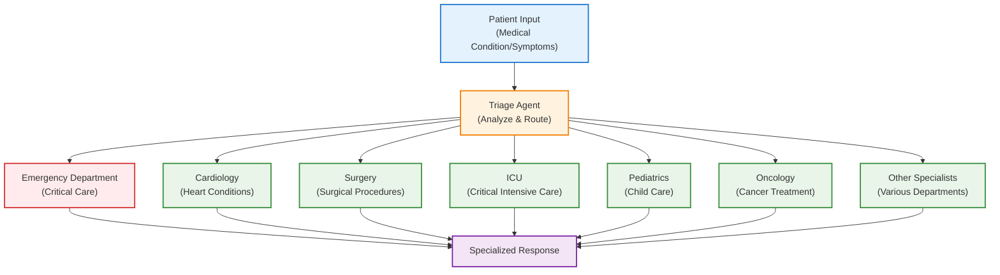

# Agentic Flows with Agent Handoffs

This document outlines the implementation of agent handoff patterns in agentic
systems, demonstrating how a triage agent can intelligently transfer
conversations to specialized medical department agents using the OpenAI Agent
SDK with Azure AI Foundry integration.

## Overview

Agent handoff patterns enable seamless transfer of conversation control between
different specialized agents based on user needs or medical conditions. This
approach is crucial for building conversational systems where different agents
excel at specific medical domains or patient care scenarios.

In **medical triage** contexts, handoff enables routing patients to appropriate
medical departments based on their symptoms or conditions. For **specialized
care**, this pattern allows transferring conversations to domain-specific
medical specialists who can provide more accurate and detailed assistance.
**Conversation continuity** is maintained as the handoff preserves the entire
conversation history when transferring between agents. Additionally, handoff
facilitates **progressive specialization** where patients can be initially
triaged and then seamlessly transferred to increasingly specialized care
providers as needed.

## Key Concepts

### Triage Agent

The initial point of contact that analyzes patient descriptions and medical
conditions to determine the most appropriate specialist department for handoff.

### Specialist Department Agents

Individual agents representing different medical departments (Emergency,
Surgery, ICU, Cardiology, etc.) with specialized knowledge and care protocols
for their respective domains.

### Agent Handoff

The process by which the triage agent transfers conversation control to a
specialist agent, maintaining conversation history and context throughout the
transition.

## Architecture

The following diagram illustrates the agent handoff architecture:



### Flow Description

1. **Patient Input**: Description of medical condition, symptoms, or health
   concerns
2. **Triage Agent**: Analyzes the patient's situation and determines the most
   appropriate medical department
3. **Specialist Department Agents**: Take over the conversation to provide
   specialized medical guidance and care
4. **Specialized Response**: Deliver domain-specific medical advice, treatment
   recommendations, or care instructions

## Best Practices

### 1. Clear Handoff Instructions

Ensure the triage agent has clear instructions for routing decisions:

```python
instructions=(
    "Handoff to the appropriate agent based on the medical condition of "
    "the patient. Analyze symptoms carefully and route to the most "
    "suitable specialist department."
)
```

### 2. Specialized Agent Instructions

Each specialist agent should have domain-specific instructions:

```python
emergency_department_agent = Agent(
    name="emergency_department_agent",
    instructions=(
        "Handle emergency medical situations promptly and efficiently. "
        "Triage patients based on the severity of their conditions and "
        "provide immediate care guidance."
    ),
    model=llm_model,
)
```
