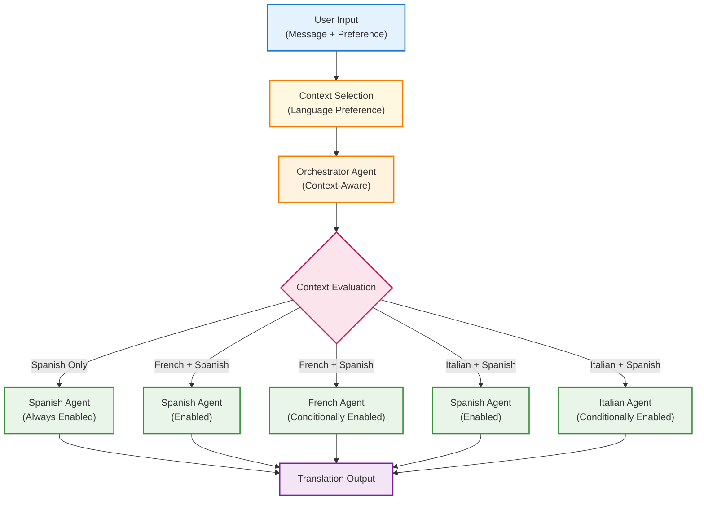

# Agentic Flows with Conditional Tool Enabling

This document outlines the implementation of conditional tool enabling patterns
in agentic systems, demonstrating how context-driven tool availability can
create dynamic, adaptable workflows using the OpenAI Agent SDK with Azure AI
Foundry integration.

## Overview

Conditional tool enabling patterns allow agents to dynamically control which
tools are available based on runtime context, user preferences, or system state.
This approach is crucial for building adaptive systems that can modify their
behavior and capabilities based on changing requirements or configurations.

In **user preference systems**, conditional enabling allows customization of
available features based on user settings or subscription levels. For **resource
management**, this pattern enables efficient allocation by activating only
necessary tools based on current system load or capacity. **Compliance
scenarios** benefit from conditional enabling by restricting tool availability
based on regulatory requirements or security clearances. Additionally,
conditional patterns facilitate **progressive disclosure** by gradually exposing
more advanced features as users demonstrate proficiency or meet specific
criteria.

## Key Concepts

### Context-Driven Enabling

The mechanism by which tool availability is determined based on runtime context,
user preferences, or system state rather than static configuration.

### Conditional Functions

Predicate functions that evaluate context and return boolean values to determine
whether specific tools should be enabled for a given execution.

### Run Context Wrapper

A container that carries contextual information throughout the agent execution
lifecycle, enabling consistent context-aware decisions.

### Dynamic Tool Registry

The system that manages which tools are available to agents based on conditional
evaluation at runtime.

## Architecture

The following diagram illustrates the conditional tool enabling architecture:



### Flow Description

1. **User Input**: Medical message with language preference selection
2. **Context Selection**: User chooses from predefined language combinations
3. **Context Evaluation**: Conditional functions determine which tools to enable
4. **Dynamic Execution**: Only enabled tools are available to the orchestrator
   agent
5. **Multi-Language Output**: All enabled translation agents execute in parallel

## Code Structure

The conditional tool enabling implementation consists of:

- **Context Model**: Pydantic model defining the runtime context structure
- **Conditional Functions**: Predicate functions that evaluate context for tool
  enabling
- **Shared Agent Library**: Reusable specialist agents defined in common modules
- **Dynamic Tool Registry**: Tools with conditional enabling based on runtime
  context
- **Context Selection**: User interface for choosing execution context
- **Structured Output**: Consistent output format across all enabled tools

## Usage

### Running the Example

```bash
# Activate virtual environment
source .venv/bin/activate

# Run the conditional tool enabling example
python -m openai_agent.agentic_patterns.tool_conditional
```
