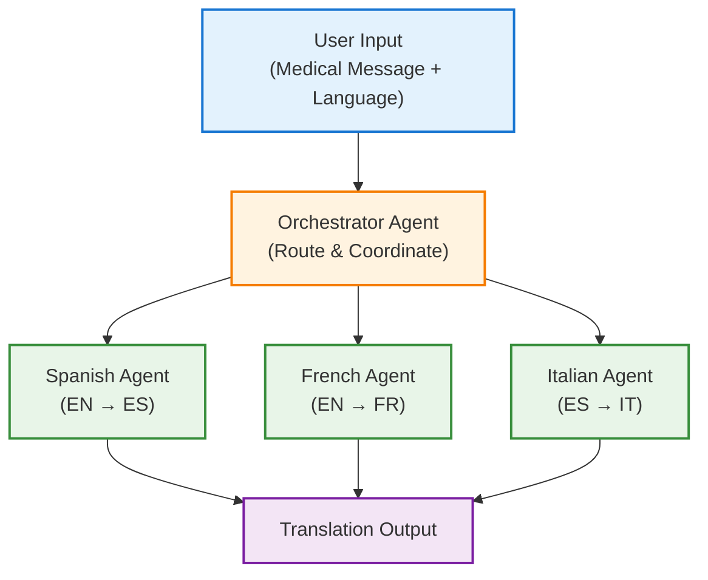

# Agentic Flows with Tool Selection and Orchestration

This document outlines the implementation of tool selection patterns in agentic
systems, demonstrating how an orchestrator agent can intelligently route tasks
to specialized agents using the OpenAI Agent SDK with Azure AI Foundry
integration.

## Overview

Tool selection patterns enable intelligent routing of tasks to specialized
agents based on user requirements or content analysis. This approach is crucial
for building scalable, modular systems where different agents excel at specific
tasks.

In **multi-language support** contexts, tool selection enables dynamic routing
to language-specific translators based on user preferences or content detection.
For **specialized processing**, this pattern allows routing different types of
medical content to appropriately trained specialists. **Scalability** is
enhanced through modular agent design where new specialist agents can be added
without modifying the orchestrator logic. Additionally, tool selection
facilitates **quality optimization** by ensuring tasks are handled by the most
appropriate specialist agent, improving overall system performance and accuracy.

## Key Concepts

### Orchestrator Agent

The central coordinator that analyzes user requests and routes them to
appropriate specialist agents based on defined criteria.

### Specialist Agents

Individual agents with specific expertise (e.g., Spanish translation, French
translation) that handle targeted tasks with domain-specific knowledge.

### Tool Selection

The process by which the orchestrator agent decides which specialist tool to use
based on user input, content analysis, or predefined rules.

### Structured Output

Using Pydantic models to ensure consistent output formats across different
specialist agents and enable type safety.

## Architecture

The following diagram illustrates the tool selection architecture:



### Flow Description

1. **User Input**: Medical message with optional target language specification
2. **Orchestrator Agent**: Analyzes the request and determines the appropriate
   translation path
3. **Specialist Agents**: Execute specialized translations with professional
   medical terminology
4. **Output Generation**: Returns structured translation results with input and
   output text

## Usage

### Running the Example

```bash
# Activate virtual environment
source .venv/bin/activate

# Run the tool selection example
python -m openai_agent.agentic_patterns.tool_selection
```

### Sample Interaction

```
Input prompt: Enter a medical message in English and specify target language (Spanish, French, Italian, or leave blank for Spanish):
User input: The patient has high blood pressure. Please translate to French.

Output:
Translation Result:
{
    "input_text": "The patient has high blood pressure. Please translate to French.",
    "translated_text": "Le patient a une tension artérielle élevée."
}
```

## Best Practices

### 1. Template-Based Instructions

Use parameterized templates to ensure consistency across specialist agents:

```python
INSTRUCTIONS = (
    "You are a professional @@domain@@ specialist in @@language@@ ..."
)
```

### 2. Clear Tool Descriptions

Provide descriptive tool names and descriptions for better orchestrator
decisions:

```python
agent.as_tool(
    tool_name="translate_to_spanish",
    tool_description="Translate the doctor's message to Spanish"
)
```

### 3. Orchestrator Guidelines

Define clear routing rules and delegation requirements:

```python
instructions=(
    "You must always delegate to tools - never attempt direct processing."
)
```

### 4. Structured Output Types

Use Pydantic models for consistent output across different specialist agents:

```python
class ProcessingOutput(BaseModel):
    input_text: str
    processed_result: str
    confidence_score: float
```
